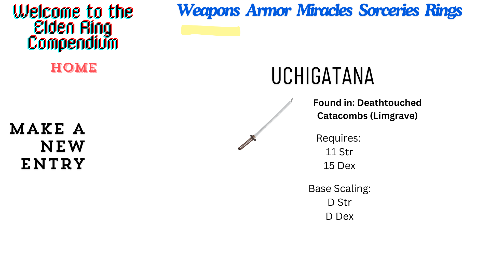

# project2
expect even a little bit more

## Approach
This ended up using all the technologies and then some, mainly some strange ones for getting the css to work (which will be mentioned again)

- I went into this knowing that I wanted at least 5 different indexes for weapons, armor, rings (or talismans), incantations, and sorceries. I also thought of adding an index of key items as well. While I could've just made them all the exact same schema of What its named and Where its found, I decided to go more in depth for the stats I cared about, like including scaling for weapons, and spell slots and fp use for spells. This warranted making different schema, which ended up needing different input (new) pages, which needed individualized show pages, which lead to each category having its own personal CRUD functions and RESTful routes. There may be an easier way to do it but brute force has never let me down yet.

- I thought of using ejs partials, but then I remembered they're advertised as saving time and work because you "only have to look at and change a couple files" but theres less files and less things to look at and change if I dont make partials. So I didnt.

## User Stories
-Great product! 10/10

-Jk

-Being able to add each new weapon I find and the location I found it to the list makes all subsequent runs easier, especially for buildcrafting

- Adding every spell found and its spell slot requirement ensures I dont go rushing out to find a cool spell only to realize I dont have enough spell slots to use it

- Also documenting their fp costs prevents the embarrasment of not having enough fp maximum to cast a spell at all

## Wireframe
check the proposal issue if this picture doesnt appear right

## Links
https://elden-compendium.onrender.com/elden
https://github.com/Eightleggedcorgi/project2
